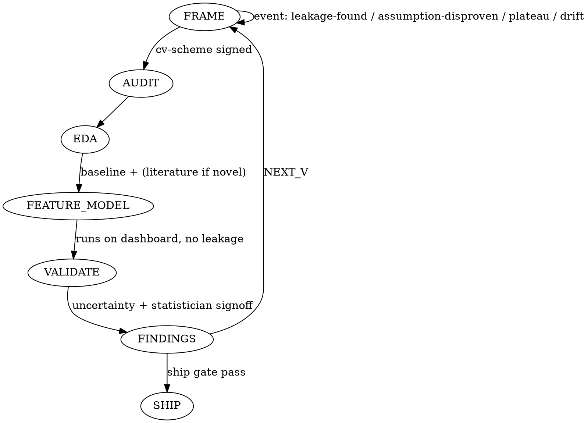

# Loop State Machine

## Phases within an iteration vN

```
FRAME → AUDIT → EDA → FEATURE_MODEL → VALIDATE → FINDINGS → (SHIP | NEXT_V)
```

## Phase entry gates

| Phase | Gate file that must exist and be signed |
|---|---|
| FRAME | `plans/vN.md` draft + `data-contract.md` |
| AUDIT | `audits/vN-cv-scheme.md` signed by Validation Auditor |
| EDA | `plans/vN.md` + Explorer persona prompt loaded |
| FEATURE_MODEL | a run tagged `baseline: true` in `runs/*/metrics.json`; if `novel-modeling-flag`, also `literature/vN-memo.md` |
| VALIDATE | no leakage patterns active; CV results with uncertainty present |
| FINDINGS | every hypothesis id resolved to finding-card OR disproven-card |

## Cross-cutting events

Events fire any time, abort the current phase, and open v(N+1).

| Event | Trigger | Response |
|---|---|---|
| `leakage-found` | Validation Auditor grep or manual finding | Mark affected runs `invalidated` on dashboard; open v(N+1) with leakage remediation as first hypothesis |
| `assumption-disproven` | Statistician or Skeptic shows framing assumption is false | File disproven-card, update `data-contract.md`, open v(N+1) |
| `metric-plateau` | Two consecutive vN with no stat-significant CV improvement | Trigger Full Literature Scout for v(N+1) |
| `cv-holdout-drift` | Gap between CV and holdout at ship gate exceeds predicted interval | Do NOT ship; open v(N+1) investigating drift source |
| `novel-modeling-flag` | Proposed model outside {linear, tree, gbm} | Require `literature/vN-memo.md` before FEATURE_MODEL |

## Stop criteria (run ends)

Run ends when ALL of:

1. User says `ship`, AND
2. All Skeptic / Validation Auditor CRITICAL blockers cleared, AND
3. CV metric meets pre-declared target, AND
4. Locked holdout evaluated exactly once → final report generated.

OR diminishing-returns gate: 3 consecutive vN with no stat-significant CV improvement → orchestrator proposes `ship` or `pivot`.

OR user says `abort`.

## State diagram


