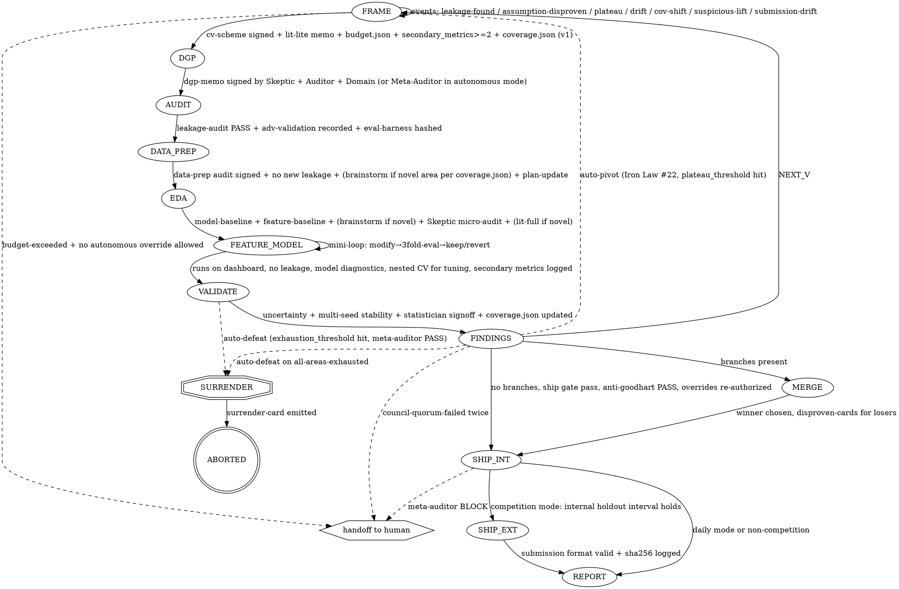

# Loop State Machine

## Phases within an iteration vN

```
FRAME → DGP → AUDIT → DATA_PREP → EDA → FEATURE_MODEL → VALIDATE → FINDINGS → (MERGE? → SHIP | NEXT_V)
```

Branches: at any point between DGP and FINDINGS, the orchestrator may FORK into `vN.a`, `vN.b`, `vN.c` (parallel sub-plans). Each branch runs the remaining phases independently. A MERGE phase picks the winner and emits disproven-cards for dropped ideas before the cycle ends.

SHIP splits in competition mode: **internal-ship** (locked internal holdout, one read) then **external-submit** (organizer's hidden test, one submission ever). In daily mode, SHIP is internal-only (no external-submit).

## Phase entry gates

Each row tags the Iron Laws enforced by that gate. Numbers refer to [iron-laws.md](iron-laws.md).

| Phase | Gate file that must exist and be signed | Iron Laws | Daily mode differences |
|---|---|---|---|
| FRAME | `plans/vN.md` draft + `data-contract.md` + `budget.json` + `plans/vN.md.pre_registration.secondary_metrics` ≥2 + `coverage.json` initialized (v1 only) | #2 (pre-reg), #6 (budget known), #21 (budget envelope), #23 (secondary metrics), #25 (coverage init) | Literature Scout memo recommended, not required. Budget envelope and secondary metrics still required. |
| DGP | `audits/vN-cv-scheme.md` signed by Validation Auditor + `literature/vN-memo.md` (Lite mode at minimum) | #3 (CV scheme pre-declared), #4 (literature anchor), #12 (DGP memo), #15 (Domain sign-off pathway) | Skeptic sign-off required; Auditor + Domain Expert advisory |
| AUDIT | `dgp-memo.md` signed by Skeptic + Validation Auditor + Domain Expert (or recorded waiver) + `audits/vN-debate-dgp.md` with `verdict: consensus-pass` + eval harness hash written to `data-contract.md` (`scripts/hash_eval_harness.py` write mode exits 0) | #7 (leakage audit), #9 (encoding audit), #11 (adv-validation recorded), #12 (DGP memo signed), #20 (harness hash locked) | Same |
| DATA_PREP | `audits/vN-data-prep.md` signed by Engineer + no new leakage from Validation Auditor + `runs/v{N}/data_baseline.txt` present + `runs/v{N}/brainstorm-v{N}-DATA_PREP.md` with ≥3 alternatives per >5%-missing column + `plans/v{N}-updates.md` revision appended | #7 (no new leakage), #8 (data baseline), #19a (brainstorm ≥3) | Same |
| EDA | `audits/vN-leakage.md` PASS + `audits/vN-adversarial.md` present (from adversarial-validation checklist) + `plans/v{N}-updates.md` revision appended at EDA exit | #7 (leakage), #11 (adv-validation), #10 (plan log) | Same |
| FEATURE_MODEL | model baseline + feature baseline `feature_baseline: true` run + `runs/v{N}/brainstorm-v{N}-FEATURE_MODEL.md` Skeptic-signed + `runs/v{N}/screen-results.json` + `runs/v{N}/screen-seed.txt` + (if mini-loop) `runs/v{N}/mini-loop/winner.json` with `skeptic_signoff: signed` + `runs/v{N}/brainstorm-v{N}-FEATURE_ENG.md` + (if tuning) `runs/v{N}/brainstorm-v{N}-TUNING.md` + `runs/v{N}/tuning-plan.md` Skeptic-signed §4 + default-params run on leaderboard + `audits/vN-model-diagnostics.md`; if `novel-modeling-flag`, also `literature/vN-memo.md` in Full mode | #5 (model baseline), #18 (model diagnostics), #19a (brainstorm), #19b (feature baseline + default-params), #20 (harness still locked) | Literature Full memo optional on novel flag; Skeptic micro-audit on model-family brainstorm still required |
| VALIDATE | no leakage patterns active; CV results with uncertainty present; nested-CV for any tuned hyperparameters; `plans/v{N}-updates.md` has `status: closed` with summary block; `audits/vN-model-synthesis.md` signed and passing `checklists/model-as-teacher.md` | #3 (CV scheme), #9 (encoding), #10 (plan log closed), #26 (model-as-teacher) | Daily: synthesis is warning-only, not blocking (all other checks same) |
| FINDINGS | every hypothesis id resolved to finding-card OR disproven-card | #17 (consistency across artefacts) | Consistency lint warning-only (not blocking) |
| MERGE | ≥2 sibling branches in `plans/vN.*.md` that have each reached FINDINGS | #17 (consistency), #19a (brainstorm preserved per branch) | Consistency lint warning-only |
| SHIP (internal) | `audits/vN-narrative.md` signed; all five persona ship-gate signatures + `audits/vN-debate-ship.md` with `verdict: consensus-pass` + `audits/vN-anti-goodhart.md` PASS + every active override re-authorized + `coverage.json` up-to-date. In autonomous mode, also: Meta-Auditor verdict PASS + Council quorum 2/3. | #1 (holdout read once), #13 (predicted-interval check), #14 (narrative audit), #17 (consistency), #19b (feature baseline on leaderboard), #22 (Council + Meta-Audit in autonomous), #23 (anti-goodhart), #24 (override re-authorization), #25 (coverage fresh) | Skeptic + Auditor + narrative audit + anti-goodhart + `audits/vN-debate-ship.md` consensus-pass |
| SHIP (external) | internal-ship passed; submission format validated; sha256 of prediction file logged | #1 (holdout already read), #16 (one-shot submission), #17 (consistency), #20 (harness lock check) | N/A in daily mode |

## Cross-cutting events

Events fire any time, abort the current phase, and open v(N+1) (or raise a branch kill).

Each event has a dedicated playbook in `playbooks/event-*.md`; the response column links to it.

| Event | Trigger | Response |
|---|---|---|
| `leakage-found` | Validation Auditor grep / encoding-audit hit / manual finding | Mark affected runs `invalidated` on dashboard; open v(N+1) with leakage remediation as first hypothesis. See [playbooks/event-leakage-found.md](playbooks/event-leakage-found.md). |
| `assumption-disproven` | Statistician / Skeptic / Domain Expert shows framing or DGP assumption is false | File disproven-card, update `data-contract.md` and `dgp-memo.md`, open v(N+1). See [playbooks/event-assumption-disproven.md](playbooks/event-assumption-disproven.md). |
| `metric-plateau` | Two consecutive vN with no stat-significant CV improvement | Trigger Full Literature Scout for v(N+1). See [playbooks/event-metric-plateau.md](playbooks/event-metric-plateau.md). |
| `cv-holdout-drift` | Gap between CV and internal holdout at internal-ship exceeds expanded predicted interval | Do NOT ship; open v(N+1) investigating drift source. See [playbooks/event-cv-holdout-drift.md](playbooks/event-cv-holdout-drift.md). |
| `covariate-shift` | Adversarial-validation AUC > 0.60 | Force CV scheme revision before continuing. See [playbooks/event-covariate-shift.md](playbooks/event-covariate-shift.md). |
| `suspicious-lift` | Single-seed CV jumps >3σ over baseline, OR seed-to-seed std on top model > 50% of lift | Freeze run as `invalidated: suspected`; dispatch Skeptic + Validation Auditor. See [playbooks/event-suspicious-lift.md](playbooks/event-suspicious-lift.md). |
| `submission-drift` | External submission format check fails, or prediction row count differs from `sample_submission.csv` | Block external-submit; remediate before any retry. See [playbooks/event-submission-drift.md](playbooks/event-submission-drift.md). |
| `eval-harness-tampered` | `hash_eval_harness.py --check` detects mismatch between current `src/evaluation/` hash and `data-contract.md` | Block phase continuation; user must invoke `override eval-harness <reason>` — orchestrator creates override artifact, writes new lock, individually marks each affected run valid or invalidated. See [playbooks/event-eval-harness-tampered.md](playbooks/event-eval-harness-tampered.md). |
| `novel-modeling-flag` | Proposed model outside `{linear, tree, gbm}` | Require `literature/vN-memo.md` in Full mode before FEATURE_MODEL. See [playbooks/event-novel-modeling-flag.md](playbooks/event-novel-modeling-flag.md). |
| `novel-feature-flag` | Feature engineering approach in brainstorm outside `{raw, binned, log-transform, interaction, aggregation, categorical-encoding, embedding}` | Require `literature/vN-memo.md` in Full mode before step 1 continues; document the gap if no prior art exists. |
| `budget-exceeded` | `scripts/budget_check.py` detects remaining envelope ≤0 on any dimension (Iron Law #21) | Block further runs; user authorizes Iron Law #24 override (`law=budget`) or autonomous mode triggers Iron Law #22 auto-defeat. See [playbooks/event-budget-exceeded.md](playbooks/event-budget-exceeded.md). |
| `auto-pivot` | `plateau_threshold` consecutive vN with no stat-sig CV improvement in autonomous mode (Iron Law #22) | Orchestrator picks next unexplored pattern area from `coverage.json`, opens v(N+1) with that area's brainstorm pre-seeded. Proposal-only in interactive mode (`audits/vN-pivot-proposal.md`). See [playbooks/event-auto-pivot.md](playbooks/event-auto-pivot.md). |
| `auto-defeat` | `exhaustion_threshold` plateaus across all pattern areas OR all areas marked `exhausted: true` (Iron Law #22) | Emit `disproven/surrender-vN.md`; `state.phase = ABORTED`; halt without further runs. Meta-Auditor signs off on ceiling evidence before the surrender-card is accepted. See [playbooks/event-auto-defeat.md](playbooks/event-auto-defeat.md). |
| `anti-goodhart-failure` | Any declared secondary metric degrades >2σ from feature-baseline value (Iron Law #23) | Block ship; produce `audits/vN-anti-goodhart.md` with delta table; propose pivot or feature-subset revert. See [playbooks/event-anti-goodhart-failure.md](playbooks/event-anti-goodhart-failure.md). |
| `override-activated` | Any file written to `overrides/vN-override-<law>.md` (Iron Law #24) | Add override id to `state.active_overrides`; flag for re-authorization at next ship gate. Overrides of core laws #1, #12, #16, #17, #20 or `law=budget` escalate to human at any scope (#16/#20 additionally reject scope=permanent outright). See [playbooks/event-override-activated.md](playbooks/event-override-activated.md). |
| `meta-audit-triggered` | `require_meta_audit_every_n_versions` reached, or before surrender-card emission, or before auto-ship | Dispatch Meta-Auditor subagent; write `<autonomous.yaml.logging.meta_audit_artifact_dir \| audits/meta/>/vN-meta-audit.md`. BLOCK verdict prevents auto-ship and surrender emission until resolved. See [playbooks/event-meta-audit-triggered.md](playbooks/event-meta-audit-triggered.md). |
| `coverage-stale` | `coverage.json` missing or not updated after VALIDATE exit for ≥2 versions (Iron Law #25) | Warning (daily) / block FINDINGS exit (competition). Orchestrator refreshes coverage from the last N leaderboard runs. See [playbooks/event-coverage-stale.md](playbooks/event-coverage-stale.md). |
| `council-quorum-failed` | Council (≥3 Skeptic subagents with distinct framings) fails to reach 2/3 agreement on a decision | First failure: retry with one fresh Skeptic-variant. Second failure on related decisions: `escalate_to_human` per `autonomous.yaml`. See [playbooks/event-council-quorum-failed.md](playbooks/event-council-quorum-failed.md). |

## Stop criteria (run ends)

Run ends when ALL of:

### Competition mode
1. User says `ship`, AND
2. All Skeptic / Validation Auditor / Domain Expert CRITICAL blockers cleared, AND
3. CV metric meets pre-declared target, AND
4. Pre-registered decisions (from `plans/v1.md`) verified unchanged OR all changes logged with rationale in `audits/vN-ship-gate.md`, AND
5. Narrative audit signed (Iron Law #14), AND
6. Internal holdout evaluated exactly once → predicted interval holds, AND
7. External submission generated, format-validated, sha256 logged → final report generated.

### Daily mode
1. User says `ship`, AND
2. All Skeptic / Validation Auditor CRITICAL blockers cleared, AND
3. CV metric meets pre-declared target (or user explicitly accepts current performance with rationale), AND
4. Narrative audit signed (Iron Law #14), AND
5. `audits/vN-debate-ship.md` has `verdict: consensus-pass` (Skeptic × Statistician debate), AND
6. Consistency lint GREEN, AND
7. Internal holdout evaluated → predicted interval checked (multiple reads allowed but each logged).

OR diminishing-returns gate: 3 consecutive vN with no stat-significant CV improvement → orchestrator proposes `ship` or `pivot`.

OR user says `abort`.

### Autonomous mode (when `<project-root>/autonomous.yaml` present)

All human-gated steps above are replaced by mechanical / Council substitutes declared
in `autonomous.yaml.persona_substitutions`. Specifically:

1. User `ship` → **auto-ship** when `autonomous.yaml.autonomy.auto_ship_when_target_met: true` AND success threshold met AND all gate criteria PASS AND Meta-Auditor verdict PASS AND Council 2/3 quorum authorizes.
2. User `pivot or ship` proposal → **auto-pivot** per Iron Law #22 (plateau_threshold).
3. User override authorization → **Council quorum 2/3** on any non-core-law override. Core-law overrides (#1, #12, #16, #17, #20 or `law=budget`) still escalate to human at any scope.
4. Budget exhausted → **auto-defeat** (emit surrender-card) rather than propose override.
5. Exhaustion threshold reached → **auto-defeat** (surrender-card emitted, `state.phase = ABORTED`).

Autonomous run terminates when ANY of:
- Auto-ship completed (success path)
- Auto-defeat completed (surrender-card with Meta-Auditor PASS)
- `escalate_to_human` event fired (handoff path; autonomous mode suspends until user resumes)
- Any CRITICAL Meta-Auditor finding
- Two consecutive Council quorum failures on related decisions

## State diagram


